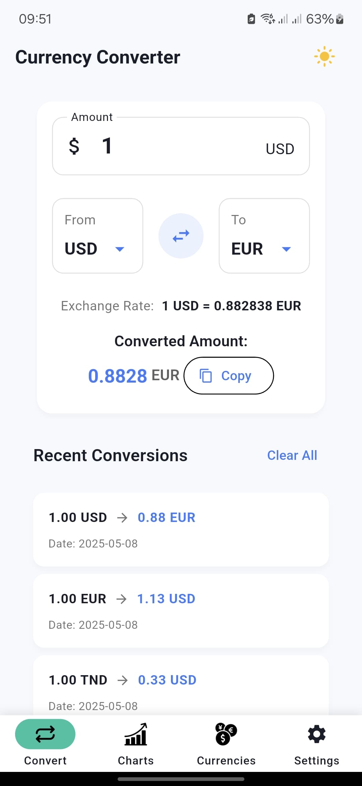
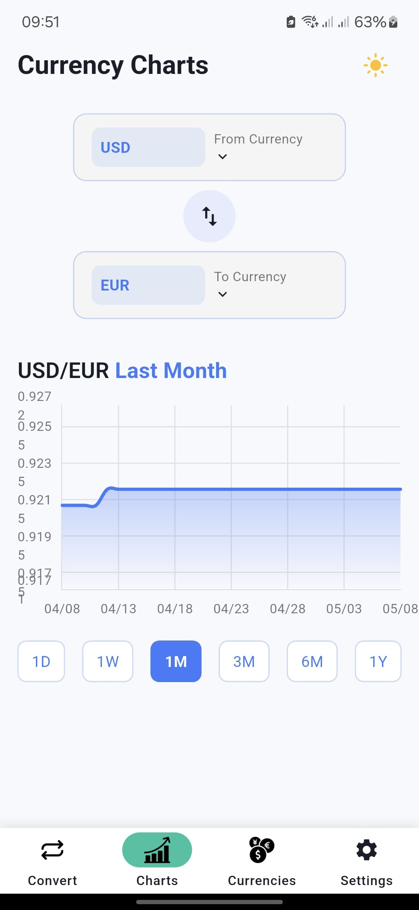
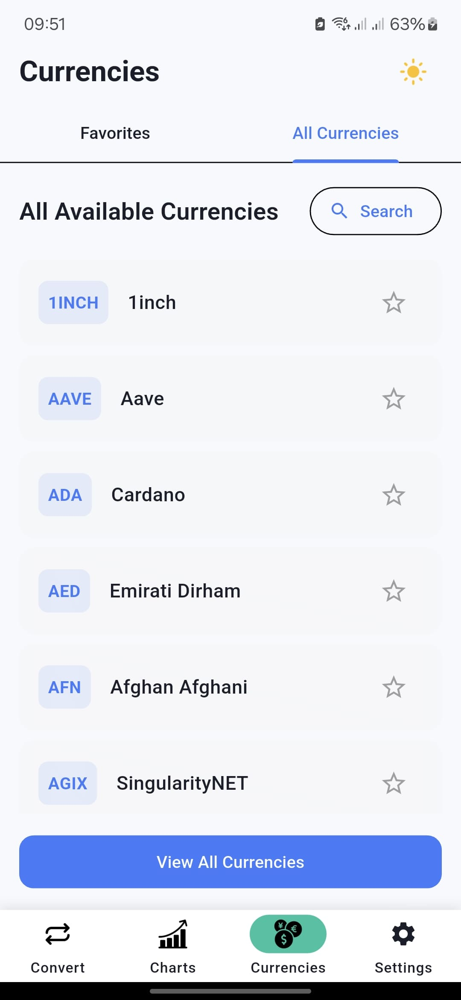
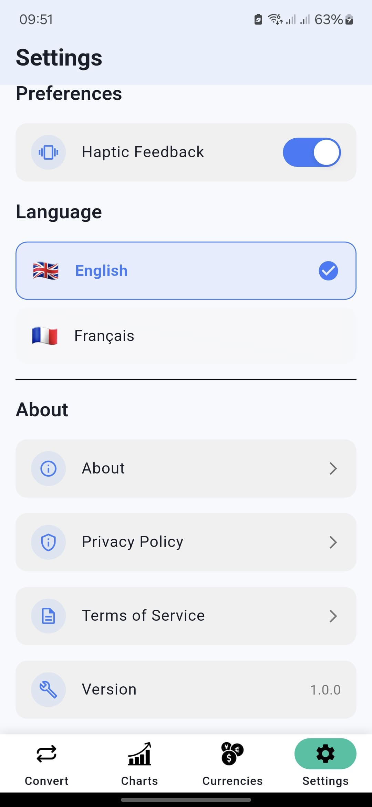
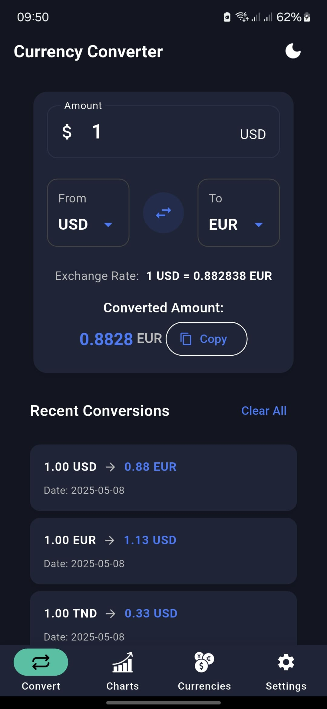
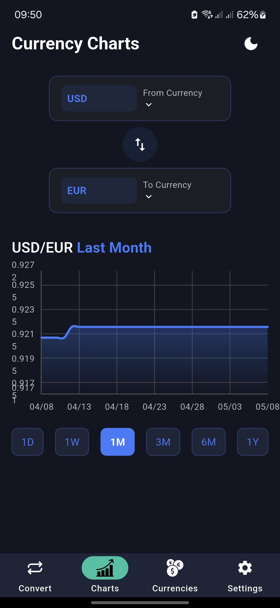
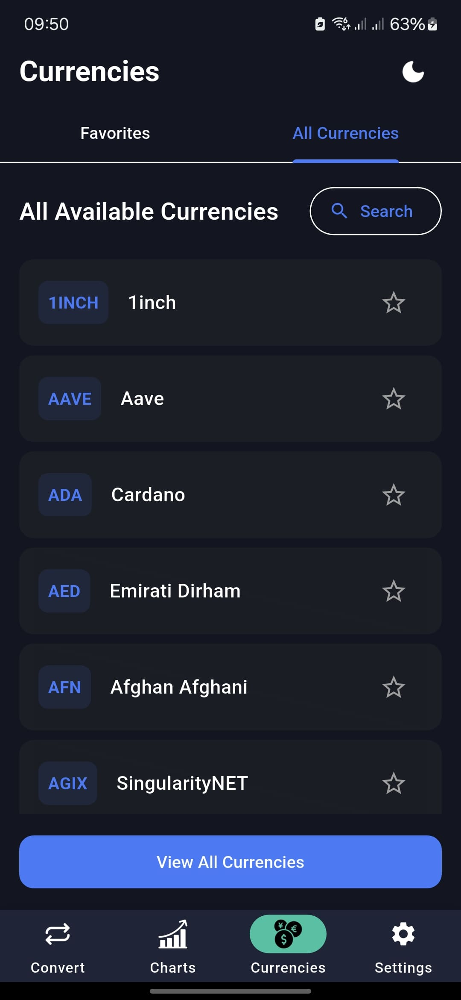
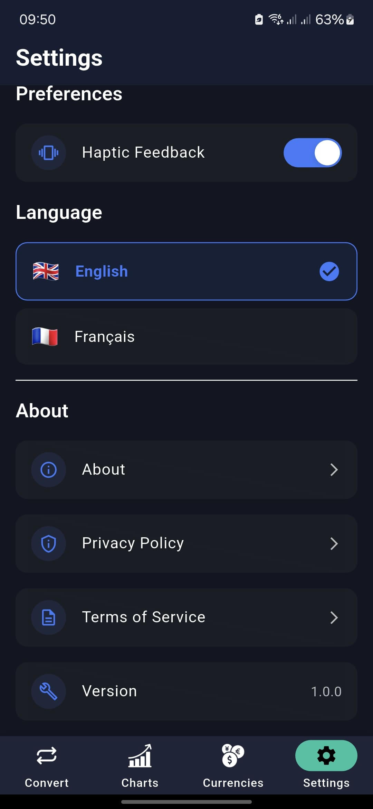

<p align="center">
  
</p>

# Currex

Real time Fiat & Crypto Converter

CurrEx is a sophisticated Flutter based currency conversion application that handles both fiat and cryptocurrency exchanges with a modern, seamless UI. The app features fluid animations, real time currency charts, and support for multiple languages.

## Features

* Real time currency conversion for both fiat and cryptocurrencies
* Interactive currency charts with multiple time periods (1D, 1W, 1M, 3M, 6M, 1Y)
* Favorites system for quick access to frequently used currencies
* Dark/light mode with smooth transition animations
* Haptic feedback throughout the app for enhanced user experience
* Multi language support (English and French)
* Offline functionality with cached rates

## Screenshots

### Light Mode

| | |
|:-------------------------:|:-------------------------:|
|  |  |
|  |  |

### Dark Mode

| | |
|:-------------------------:|:-------------------------:|
|  |  |
|  |  |

## Technical Specifications

* Built with Flutter
* Supports Android and iOS platforms
* Integrates with Currency API
* Custom animations
* Shimmer loading animations
* Provider state management
* Theme system with easy customization

## Project Structure

```
lib/
├── screens/
│   ├── main/
│   ├── settings/
│   └── ...
├── surfaces/
├── components/
├── widgets/
├── utilities/
├── providers/
└── main.dart
```

## Getting Started

### Prerequisites

* Flutter SDK
* Dart SDK
* Android Studio / Xcode for emulators

### Installation

1. Clone the repository
2. Navigate to the project directory
3. Install dependencies:
   `flutter pub get`
4. Run the app:
   `flutter run`

## License

This project is licensed under the MIT License.

## Acknowledgments

* Currency conversion API by Fawaz Ahmed
* Flutter team for the amazing framework
